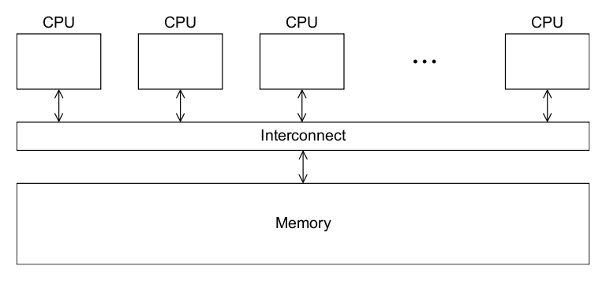
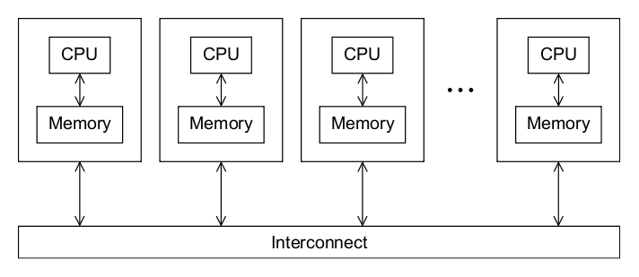
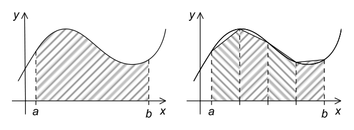
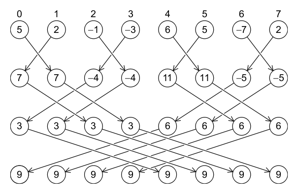
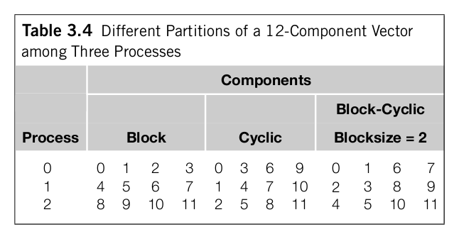
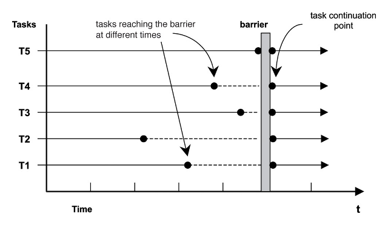
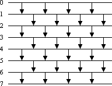

# MPI

----
# MIMD

## 2 modelos

* Memoria Distribuida
* Memoria Compartida

----

# Memoria compartida

* Comunicación via *reads*/*writes*
* Problemas de concurrencia clásicos (*race conditions*, *deadlocks*)
* Primitivas de sincronización explícitas (locks, semáforos)

----

# Memoria distribuida

* Comunicación vía paso de mensajes (*send*/*receive*)
* No hay race conditions (aunque posibles deadlocks)
* Sincronización por comunicación
* Todos los datos compartidos deben copiarse

----
# MPI

## Message Passing Interface

* Basado en memoria distribuida
* SPMD
    * Single program
    * Multiple data
* Proceso: programa corriendo en un par (CPU + memoria)
* Comunicación y sincronización via *send* + *receive*

MPI es una API, definida de forma estándar para FORTRAN y C

----
# Hola mundo, en C (sin MPI)

    !c
    #include <stdio.h>
    int main(void) {
        printf("hello, world\n");
        return 0;
    }

Lo compilamos con:

    !bash
    $ gcc -o hello hello.c 

Y lo corremos:

    !bash
    $ ./hello

----
# Hola mundo, en MPI

## Código fuente

    !c
    #include <stdio.h>
    #include <string.h>
    #include <mpi.h>

    const int MAX_STRING = 100;

    int main(int argc, char **argv) {
        char greeting[MAX_STRING];
        int comm_sz;
        int my_rank;

        MPI_Init(&argc, &argv);
        MPI_Comm_size(MPI_COMM_WORLD, &comm_sz);
        MPI_Comm_rank(MPI_COMM_WORLD, &my_rank);

        if (my_rank != 0) {
            sprintf(greeting, "Saludos desde el proceso %d de %d!", my_rank, comm_sz);
            MPI_Send(greeting, strlen(greeting)+1, MPI_CHAR, 0, 0, MPI_COMM_WORLD);
        } else {
            int q;
            printf("Saludos desde el proceso %d de %d!\n", my_rank, comm_sz);
            for (q = 1; q < comm_sz; q++) {
                MPI_Recv(greeting, MAX_STRING, MPI_CHAR, q, 0,
                         MPI_COMM_WORLD, MPI_STATUS_IGNORE);
                printf("%s\n", greeting);
            }
        }

        MPI_Finalize();
        return 0;
    }

----
# Hola mundo en MPI

## Compilando

    !bash
    $ mpicc -o hello-mpi hello-mpi.c

`mpicc` envuelve a gcc, toma los mismos argumentos
    
## Ejecutando

    !bash
    $ mpiexec -n 1 ./hello-mpi
    Saludos desde el proceso 0 de 4!

    $ mpiexec -n 4 ./hello-mpi
    Saludos desde el proceso 0 de 4!
    Saludos desde el proceso 1 de 4!
    Saludos desde el proceso 2 de 4!
    Saludos desde el proceso 3 de 4!

`mpiexec` se comunica con nuestro cluster, distribuye el programa y crea todos
los procesos.

----
# De dónde saco un cluster?

Hay que configurar `mpd` en cada nodo

    !bash
    $ sudo apt-get install mpich2 libmpich2-dev
    $ cat MPD_SECRETWORD=famaf2012 > ~/.mpd.conf
    $ chmod 600 ~/.mpd.conf

## Un pseudo-cluster de un nodo

    !bash
    mi-pc$ mpd --ncpus=4

## Un poco más en serio

    !bash
    amo$ mpd --daemon --ncpus=4
    amo$ mpdtrace -l
    amo_49840 (127.0.0.1)
    ...
    esclavo-1$ mpd --host=amo --port=49840 --ncpus=2
    esclavo-2$ mpd --host=amo --port=49840 --ncpus=6

## Para "desactivar" el cluster

    !bash
    $ mpdexit localmpd

----
# Desarmando el código

Encabezados:

    !c
    ...
    #include <mpi.h>
    ...

Inicialización/finalización de la biblioteca
    
    !c
    int main(int argc, char **argv) {
        ...
        MPI_Init(&argc, &argv);
        ...
        MPI_Finalize();
        return 0;
    }

----
# Communicators

* Qué es? colección de procesos
* Ya viene armado: `MPI_COMM_WORLD`
* Se pueden armar otros

Se puede consultar el tamaño de un communicator:

    !c
    int MPI_Comm_size( MPI_Comm comm, int *size )

Y cada proceso tiene un `rank` unico `[0..size)` dentro de un communicator

    !c
    int MPI_Comm_rank( MPI_Comm comm, int *rank )

----
# Desarmando el código

Identificando al universo de procesos

    !c
        MPI_Comm_size(MPI_COMM_WORLD, &comm_sz);
        MPI_Comm_rank(MPI_COMM_WORLD, &my_rank);

Y actuando para separar comportamiento:

    !c
        if (my_rank != 0) {
            ... my_rank ...
            ...
        } else {
            ...
            ... my_rank ...
            ...
        }

----
# SPMD

* No se escriben programas separados por proceso
* No necesariamente todos los procesos acaban haciendo lo mismo
    * distinto rank
    * distintos datos
* En realidad eso es la situación típica
* Diseño "escalable" de los programas

En el ejemplo, el proceso 0 recibe mensajes y los muestra

    !c
            int q;
            printf("Saludos desde el proceso %d de %d!\n", my_rank, comm_sz);
            for (q = 1; q < comm_sz; q++) {
                MPI_Recv(greeting, MAX_STRING, MPI_CHAR, q, 0,
                         MPI_COMM_WORLD, MPI_STATUS_IGNORE);
                printf("%s\n", greeting);
            }

Los procesos `[1..n)` generan mensajes y los envían

    !c
            sprintf(greeting, "Saludos desde el proceso %d de %d!", my_rank, comm_sz);
            MPI_Send(greeting, strlen(greeting)+1, MPI_CHAR, 0, 0, MPI_COMM_WORLD);

----
# Comunicación

La operación básica para enviar es `MPI_Send`

    !c
    int MPI_Send(
        void        *buf,
        int          count,
        MPI_Datatype datatype,
        int          dest,
        int          tag,
        MPI_Comm     comm)

Puede comportarse de forma bloqueante

<table>
    <tr><th>MPI_Datatype</th><th>Tipo en C</th></tr>
    <tr><td>MPI_CHAR</td><td>signed char</td></tr>
    <tr><td>MPI_INT</td><td>int</td></tr>
    <tr><td>MPI_LONG</td><td>long</td></tr>
    <tr><td>MPI_LONG_LONG</td><td>long long</td></tr>
    <tr><td>MPI_UNSIGNED_CHAR</td><td>unsigned char</td></tr>
    <tr><td>MPI_UNSIGNED_SHORT</td><td>unsigned short</td></tr>
    <tr><td>MPI_UNSIGNED</td><td>unsigned int</td></tr>
    <tr><td>MPI_UNSIGNED_LONG</td><td>unsigned long</td></tr>
    <tr><td>MPI_FLOAT</td><td>float</td></tr>
    <tr><td>MPI_DOUBLE</td><td>double</td></tr>
    <tr><td>MPI_LONG_DOUBLE</td><td>long double</td></tr>
    <tr><td>MPI_BYTE</td><td>-</td></tr>
    <tr><td>MPI_PACKED</td><td>-</td></tr>
</table>

----
# Comunicación

La operación básica para enviar es `MPI_Recv`

    !c
    int MPI Recv(
        void        *msg_buf_p,
        int          buf_size,
        MPI_Datatype buf_type,
        int          source,
        int          tag,
        MPI_Comm     comm,
        MPI_Status  *status_p)

Los primeros 6 argumentos son como en `MPI_Send`
        
En `status_p` se puede usar `MPI_STATUS_IGNORE`.

Sino, sirve para identificar “metadatos” del mensaje.

----
# Comunicación

## Message matching

Si *q* envía, *r* puede recibir el mensaje cuando

* `recv_comm == send_comm`
* `recv_tag == send_tag`
* `dest == ` *r*
* `source == ` *q*

Además para que la operación sea exitosa, los buffers deben ser compatibles en
tipo y tamaño.

Hay “comodines” **en el receptor**:

* `MPI_ANY_SOURCE`
* `MPI_ANY_TAG`

----
# Comunicación

## Identificando al mensaje:

Para eso se usa el argumento `status_p`. Los elementos desconocidos que podemos
tener son:

* Cantidad de datos recibidos: `MPI_Get_count(&status, recv_type, &count)`
* Origen: `status.MPI_SOURCE`
* Tag: `status.MPI_TAG`

----
# Semántica de los mensajes

* La sincronización del **emisor** depende de implementación
    * Puede haber buffering
    * Puede haber bloqueo
* El **receptor** es siempre bloqueante
    * Deadlocks!

Hay funciones para cambiar este comportamiento.

Además:

* Se preserva orden entre mensajes **de un mismo emisor**

----
# Ejemplo: regla del trapecio

Se aproxima una integral como suma de áreas de trapecios

Dividimos el intervalo `[a,b]` en *n* segmentos, cada uno de *h=b-a/n* de ancho.
Esto define puntos *x[0]=a*, *x[1]*, *x[2]*, ..., *x[n]=b*. Tenemos que 
*x[k+1] = x[k]+h*.

Cada trapecio tiene área *(f(x[i]) + f(x[i+1])) h / 2*

Entonces nuestra aproximación es

*I = h ( f(x[0])/2 + f(x[1]) + f(x[2]) + ... + f(x[n-1]) + f(x[n])/2)*

----
# Ejemplo: regla del trapecio

## Versión secuencial

Sin paralelismo:

    !c
    h = (b-a)/n;
    approx = (f(a) + f(b))/2.0;
    for (i = 1; i <= n-1; i++) {
        x_i = a + i*h;
        approx += f(x_i);
    }
    approx = h*approx;

Se paraleliza con una “receta” típica:

1. Particionar la solución en tareas
2. Identificar los canales de comunicación entre tareas
3. Acumular las tareas en tareas mayores
4. Asignar las tareas mayores a *cores* de ejecución

----
# Ejemplo: regla del trapecio

## Version paralela (pseudocódigo)

Supongamos para simplificar que `n` es divisible por `comm_sz`

    !c
    h = (b-a)/n;
    local_n = n/comm_sz;
    local_a = a + my_rank*local_n*h;
    local_b = local_a + local_n*h;
    local_integral = ReglaTrapecio(local_a, local_b, local_n, h);

    if (my_rank != 0)
        mandar local_integral al proceso 0
    else /* my_rank == 0 */
        total_integral = local_integral;
        for (proc = 1; proc < comm_sz; proc++) {
            Recibir local_integral desde proc;
            total_integral += local_integral;
        }
    }
    if (my rank == 0)
        print result;

Cuidado con la entrada/salida!

----
# Ejemplo: regla del trapecio

## Manejando entrada

    !c
    void Get_input(int     my_rank
                   int     comm_sz
                   double *a_p
                   double *b_p
                   int    *n_p
                   int     dest)
    {
        if (my_rank == 0) {
            printf("Enter a, b, and n\n");
            scanf("%lf %lf %d", a_p, b_p, n_p);
            for (dest = 1; dest < comm sz; dest++) {
                MPI_Send(a_p, 1, MPI_DOUBLE, dest, 0, MPI_COMM_WORLD);
                MPI_Send(b_p, 1, MPI_DOUBLE, dest, 0, MPI_COMM_WORLD);
                MPI_Send(n_p, 1, MPI_INT, dest, 0, MPI_COMM_WORLD);
            }
        } else { /* my rank != 0 */
            MPI_Recv(a_p, 1, MPI_DOUBLE, 0, 0, MPI_COMM_WORLD, MPI_STATUS_IGNORE);
            MPI_Recv(b_p, 1, MPI_DOUBLE, 0, 0, MPI_COMM_WORLD, MPI_STATUS_IGNORE);
            MPI_Recv(n_p, 1, MPI_INT, 0, 0, MPI_COMM_WORLD, MPI_STATUS_IGNORE);
    }

----
# Comunicación colectiva

* La suma global que hicimos es ineficiente
    * El proceso 0 hace `comm_sz` receive seguidos
* Alternativa: comunicación en árbol
    * Cuánto es a mejora de performance?
    * Hay una sola forma de hacerlo?
    * Cómo se programa?

La implementación de MPI incluye `MPI_Reduce`

    !c
    int MPI_Reduce(void        *sendbuf,
                   void        *recvbuf,
                   int          count,
                   MPI_Datatype datatype,
                   MPI_Op       op,
                   int          root,
                   MPI_Comm     comm)
                   
    MPI Reduce(&local_int, &total_int, 1, MPI_DOUBLE, MPI_SUM, 0, MPI_COMM_WORLD);

----
# Comunicación colectiva

`MPI_Reduce`:

* Puede recibir vectores
* Todos los procesos involucrados usan la misma función, con argumentos compatibles
* No se permite aliasing

<table>
    <tr><th>MPI_Op</th><th>Significa</th></tr>
    <tr><td>MPI_MAX</td><td>Máximo valor</td></tr>
    <tr><td>MPI_MIN</td><td>Mínimo valor</td></tr>
    <tr><td>MPI_MAXLOC</td><td>Máximo valor e índice de este</td></tr>
    <tr><td>MPI_MINLOC</td><td>Mínimo valor e índice de este</td></tr>
    <tr><td>MPI_SUM</td><td>+</td></tr>
    <tr><td>MPI_PROD</td><td>×</td></tr>
    <tr><td>MPI_LAND</td><td>AND lógico</td></tr>
    <tr><td>MPI_BAND</td><td>AND bit a bit</td></tr>
    <tr><td>MPI_LOR</td><td>OR lógico</td></tr>
    <tr><td>MPI_BOR</td><td>OR bit a bit</td></tr>
    <tr><td>MPI_LXOR</td><td>XOR lógico</td></tr>
    <tr><td>MPI_BXOR</td><td>XOR bit a bit</td></tr>
</table>

----
# Comunicación colectiva

    !c
    int MPI_Allreduce(void        *sendbuf,
                      void        *recvbuf,
                      int          count,
                      MPI_Datatype datatype,
                      MPI_Op       op,
                      MPI_Comm     comm)

----
# Comunicación colectiva

    !c
    int MPI_BCast(void        *buf,
                  int          count,
                  MPI_Datatype datatype,
                  int          source,
                  MPI_Comm     comm)

Con esto la recolección de entrada puede ser:

    !c
    void Get_input(int     my_rank
                   int     comm_sz
                   double *a_p
                   double *b_p
                   int    *n_p
                   int     dest)
    {
        if (my_rank == 0) {
            printf("Enter a, b, and n\n");
            scanf("%lf %lf %d", a_p, b_p, n_p);
        }
        MPI_Bcast(a_p, 1, MPI_DOUBLE, 0, MPI_COMM_WORLD);
        MPI_Bcast(b_p, 1, MPI_DOUBLE, 0, MPI_COMM_WORLD);
        MPI_Bcast(n_p, 1, MPI_INT, 0, MPI_COMM_WORLD);
    }

----
# Distribución de datos

Otro ejemplo, suma de vectores. En versión secuencial:

    !c
    void Vector sum(double x[], double y[], double z[], int n) {
        int i;
        for (i = 0; i < n; i++)
            z[i] = x[i] + y
    }

* Las tareas son sumar componentes individuales
* No requiere comunicación! Sólo distribuir tareas en cores
    * ¿cómo?

----
# Particiones

----
# Scatter

Distribuye particiones a procesos

    !c
    int MPI_Scatter(void        *sendbuf,
                    int          sendcnt,
                    MPI_Datatype sendtype,
                    void        *recvbuf,
                    int          recvcnt,
                    MPI_Datatype recvtype,
                    int root,
                    MPI_Comm comm)

* `sendcnt` es la cantidad de datos transmitida *a cada proceso*
* Partición por bloques
* Sólo sirve si la cantidad de datos es multiplo de `comm_sz`

----
# Gather

Inversa de scatter

    !c
    int MPI_Gather(void        *sendbuf,
                   int          sendcnt,
                   MPI_Datatype sendtype,
                   void        *recvbuf,
                   int          recvcnt,
                   MPI_Datatype recvtype,
                   int root,
                   MPI_Comm comm)

* `sendcnt` es la cantidad de datos recibida *de cada proceso*
* Partición por bloques
* Sólo sirve si la cantidad de datos es multiplo de `comm_sz`

Y también hay `Allgather`

----
# Ejemplo: multiplicación matriz/vector

Versión serial:

    !c
    for (i = 0; i < m; i++) {
        y[i] = 0.0;
        for (j = 0; j < n; j++)
            y[i] += A[i][j]*x[j];
    }

Típicamente uno no escribe así en C; hace falta mapear arreglos 2D a 
arreglos 1D.

Supongamos que cada tarea es el ciclo interior:

    !c
    for (j = 0; j < n; j++)
        y[i] += A[i*n + j] * x[j];

Y que queremos multiplicar repetidas veces

----
# Ejemplo: multiplicación matriz/vector

    !c
    x = malloc(n*sizeof(double));
    MPI_Allgather(local_x, local_n, MPI_DOUBLE,
        x, local_n, MPI_DOUBLE, comm);
    for (local_i = 0; local_i < local_m; local_i++) {
        local_y[local_i] = 0.0;
        for (j = 0; j < n; j++)
            local_y[local_i] += local_A[local_i*n+j]*x[j];
    }
    free(x);

----
# Sincronización

## `MPI_Barrier`

En general la sincronización es por comunicación, pero también hay
sincronización pura:

    !c
    int MPI_Barrier( MPI_Comm comm )

----
# Nociones de performance

* timing
* speedup

* Comunicación vs procesmiento

----
# Ejemplo: parallel sorting

N fases de una sorting network (odd-even transposition sort):

* Cada tarea: Determinar el valor de `a[i]` en la fase `j`
* Comunicación: pasar el valor de `a[i]` al vecino que lo necesita.

A menos que N=p, podemos hacer esto de a bloques

ver detalles en: “An Introduction to Parallel Programming”, Peter Pacheco

----
# Ejemplo: parallel sorting

## Intercambiando bloques

    !c
    MPI_Send(my_keys, n/comm_sz, MPI_INT, partner, 0, comm);
    MPI_Recv(temp_keys, n/comm_sz, MPI_INT, partner, 0, comm, MPI_STATUS_IGNORE);

* Es seguro hacerlo así?
* Podemos detectar problemas vía testing? `MPI_Ssend`

Para intercambios, también hay `MPI_Sendrecv`, y `MPI_sendrcv_replace`

